# **유니티 준비하기**  
# **유니티 엔진은 무엇인가**  
유니티는 2D와 3D 그래픽을 지원하는 다목적 게임 엔진으로 다양한 장점을 가지고 있다.  
  
먼저 대부분의 기능이 개인 개발자에게 무료다. 그리고 현재 가장 많이 사용하는 게임 엔진으로 한국어와 영어 모두 참고할 만한 자료가 풍부하다. 또한 멀티
플랫폼을 지원해서 한 프로젝트에서 모바일과 데스크톱, 콘솔 게임용으로 빌드할 수 있다.  
  
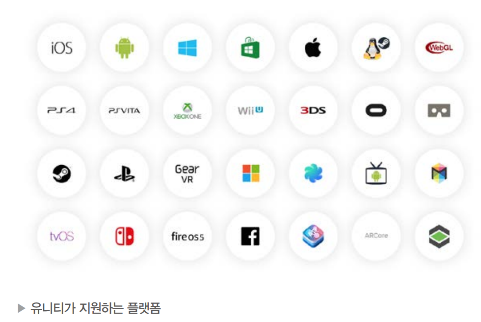  
  
유니티는 직관적인 에디터를 가지고 있어 드래그&드롭을 통해 대부분의 오브젝트를 편집할 수 있다. 물리 엔진을 내장하고 있기에 수학적으로 물리를 직접 
구현하지 않아도 된다. 에셋 스토어에서 개발에 필요한 사운드, 3D 모델, 코드를 쉽게 구할 수 있다.  
  
또한 주기적으로 추가되는 신기술과 새로운 도구 덕분에 게임 이외에 다양한 분야에서도 유니티를 사용할 수 있다. 예를 들어 유니티에 ML-Agents 추가 패키지를 
사용하여 강화학습 인공지능을 연구할 수 있다.  
  
또는 타임라인, 시네머신, 시퀀스 등의 시네마틱 도구를 이용하면 독특한 비주얼과 영화적 연출을 빠르게 제작할 수 있다. 이에 따라 상업 영화나 TV 
애니메이션 제작에 유니티를 사용하는 사례가 늘고 있다.  
  
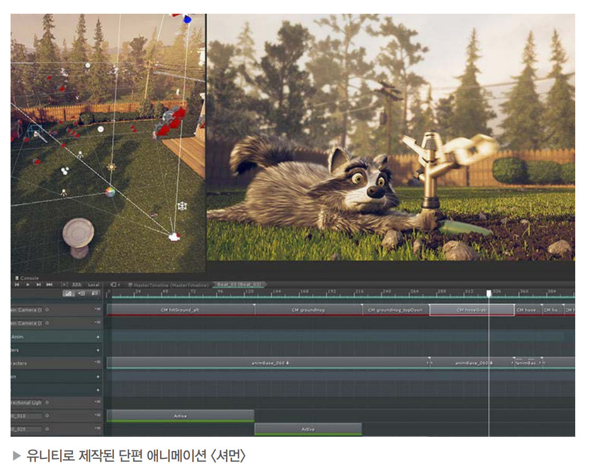  
  
하지만 이런 특징들이 입문자가 유니티를 사용해야 하는 가장 큰 이유는 아닏나. 대부분의 입문자는 유니티를 처음 접하는 순간 유니티가 프로그래머만을 
위한 도구는 아닌 것 같다는 인상을 받는다. 단순히 에디터의 UI 디자인이 충실해서 그런 것만은 아니다.  
  
처음 게임 개발에 입문하면 게임의 모든 부분을 바닥부터 코드로 전부 작성하고 통제해야 한다고 생각하기 쉽다. 유니티는 코드를 작성하기 전에 미리 만들어진 
부품을 조립하여 게임 오브젝트를 만든다. 코드는 미리 만들어진 부품을 제어하기 위해 작성한다. 따라서 공학적 원리보다 게임의 전체 로직에 좀 더 집중할 
수 있다.  
  
그런데 쉬운 개발을 지향하는 게임 엔진들은 버그나 메모리 누수 등 완성도가 부족한 프로그램을 만들기 쉽다. 쉬운 사용법만큼 깊이 있게 게임 개발을 공부하기 
힘들어 개발자로서 성장하기도 힘들다.  
  
유니티는 가장 인기 있는 개발 플랫폼 중 하나인 .NET과 C#을 사용하며 여러 신기술도 적극적으로 도입한다. 따라서 소프트웨어 엔지니어로서 공부하면서 자신의 
프로그램을 분석하고 보완할 수 있는 여지가 많다.  
  
유니티는 뛰어난 프로그래머가 아니라고 해도 쉽게 시작하여 결과물을 만들 수 있으면서 게임 프로그래밍을 깊이 공부할 수 있다.  
  
# **개발 환경 구성**  
# **유니티 회원 가입**  
유니티 엔진은 사용자 로그인을 해야 사용할 수 있다. 그러므로 유니티를 설치하기 전에 유니티 웹사이트에서 회원 가입을 한다.  
  
- 유니티 공식 웹사이트(unity.com) 접속 -> 우측 상단의 프로필 아이콘 클릭  
- Unity ID 만들기(Create a Unity ID) 클릭 -> 가입 페이지로 이동  
  
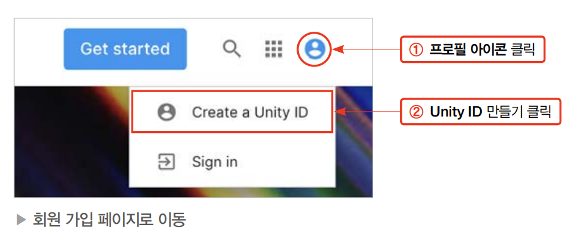  
  
- 회원 가입 정보를 입력  
- Unity ID 만들기 클릭  
  
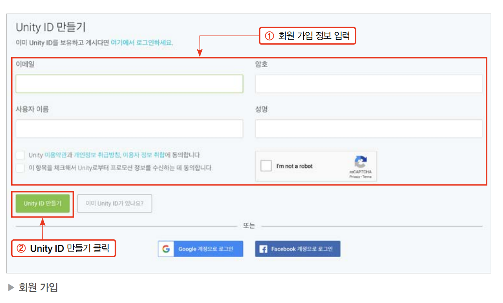  
  
이것으로 임시 가입이 완료된다. 가입에 사용한 이메일에서 인증 메일을 확인하면 가입이 쵲오 승인되고 계정이 활성화된다.  
  
- 메일함에 도착한 인증 메일로 본인 인증  
  
# **유니티 허브 설치**  
유니티를 사용하기 위한 시스템 최소 요구 사항은 다음과 같다. 하드웨어나 OS가 명시된 버전보다 이전 버전이라면 유니티가 정상적으로 실행되지 않는다.  
  
- OS: 윈도우 7 SP1 (64비트) / 맥OS 시에라(macOS Sierra) / 우분투 16.4 또는 CentOS7  
- GPU: DX10 또는 셰이더 4.0을 지원할 수 있는 GPU  
  
대부분의 경우 유니티가 정상적으로 실행된다. 하지만 모바일 CPU를 사용하는 윈도우 태블릿 컴퓨터나 32비트 윈도우에서는 유니티가 정상적으로 실행되지 
않는다.  
  
유니티 허브를 통해 유니티를 설치한다. 유니티 허브는 사용자가 유니티를 원 클릭으로 설치하고 여러 버전의 유니티를 한 컴퓨터에서 동시에 사용할 수 
있도록 관리하는 도구다.  
  
- 유니티 다운로드 페이지(unity.com/download)에 접속  
- 운영체제에 맞춰 유니티 허브 다운로드  
  
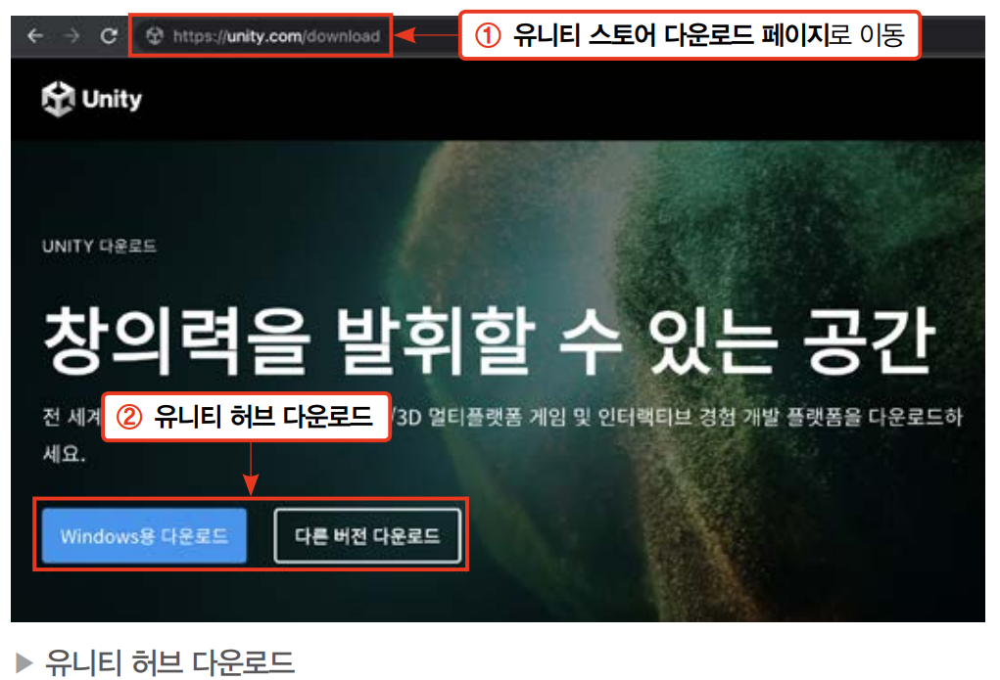  
  
# **유니티 허브 설정**  
설치가 끝나면 유니티 허브를 실행하고 라이선스를 설정한다.  
  
- 유니티 허브에서 Sign in 클릭 -> 로그인 웹페이지 열림  
- 이메일과 패스워드를 입력하고 로그인 -> 유니티 허브로 리다이렉트  
  
로그인 후에는 첫 유니티 에디터를 설치하는 안내 창이 표시된다. 하지만 원하는 버전의 유니티 에디터를 직접 선택하기 위해 해당 과정은 생략한다.  
  
그다음에는 첫 라이선스를 활성화하는 창이 표시된다. 이전에 해당 컴퓨터에서 유니티 라이선스를 설정한 적이 있다면 라이선스 설정 과정이 생략될 수도 있다.  
  
- 유니티 에디터 설치 홤녀에서 Skip installation 클릭  
- 라이선스 활성화 홤녀에서 Agree and get personal edition license 버튼 클릭  
  
만약 어떠한 이유로 첫 라이선스 활성화 과정을 생략했거나 라이선스 활성화 창이 표시되지 않으면 다음 과정을 통해 라이선스를 설정할 수 있다.  
  
- 왼쪽 상단의 톱니바퀴 버튼 -> Preferences 창에서 Licenses 탭 클릭  
- Add 버튼 클릭 -> 라이선스 추가 창으로 이동  
- Get a free personal license 선택 -> Agree and get personal edition license 클릭  
  
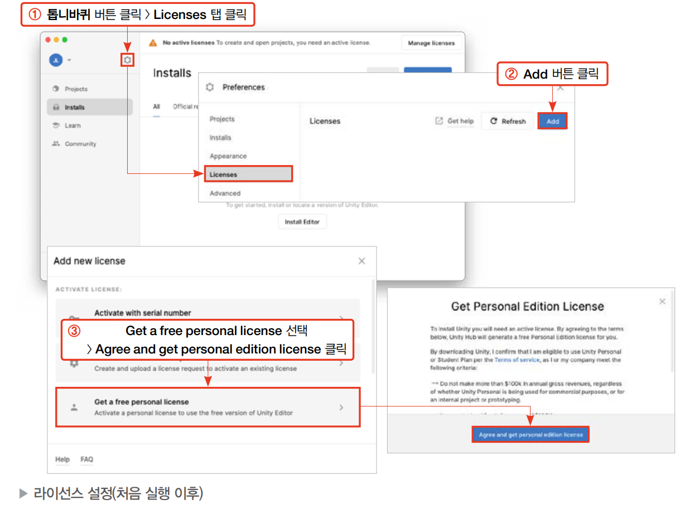  
  
유니티는 개인이나 취미 개발자가 무료로 사용 가능한 Personal 라이선스와 유료 구독이 필요한 Pro, Enterprise 등의 라이선스를 제공한다. 무료 라이선스로 
빌드된 게임에는 유니티 로고 인트로가 삽입된다.  
  
유니티 허브의 좌측 메뉴 중 가장 첫 번째 탭인 Projects 탭에서는 최근에 열었던 프로젝트 목록을 표시한다.  
  
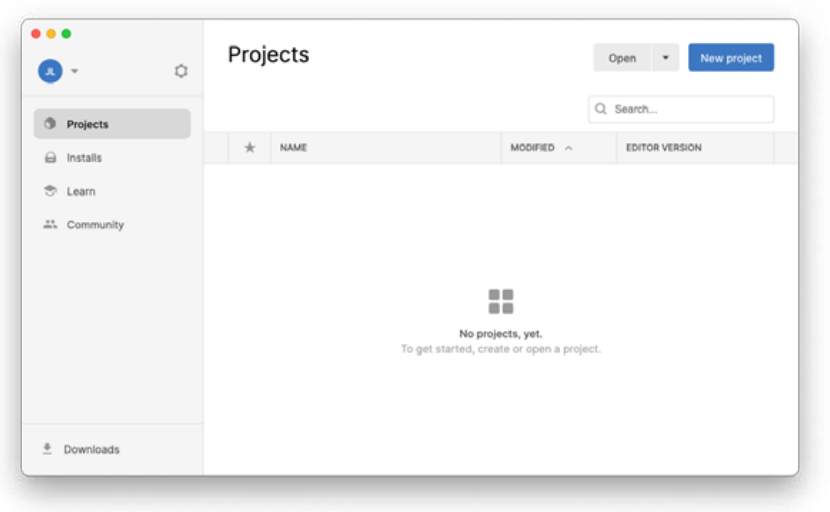  
  
Installs 탭에서는 원하는 버전의 유니티를 골라 설치할 수 있다. Learn 탭에서는 유용한 학습 자료와 튜토리얼 프로젝트를 다운로드할 수 있다.  
  
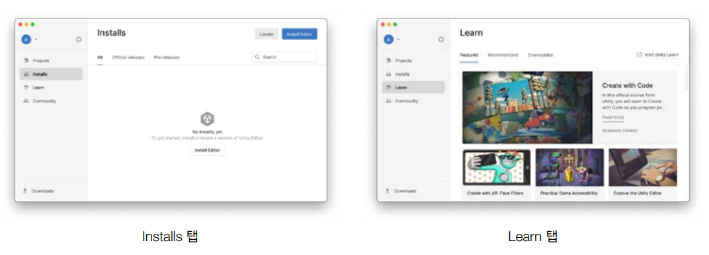  
  
- 유니티 에디터  
유니티와 유니티 에디터는 서로 혼용되는 단어다. 둘 다 유니티로 뭉뚱그려 부르는 경우가 많지만 게임 오브젝트와 에셋을 편집하는 창과 여러 개발 도구를 
제공하는 유니티 프로그램을 정확하게는 유니티 에디터라고 한다.  
  
유니티가 유니티 전체 요소를 가리키는 단어라면 유니티 에디터는 유니티 개발 프로그램과 그 창을 특정하는 것이다.  
  
# **유니티 에디터 설치**  
유니티 허브에서 원하는 버전의 유니티 에디터를 골라 설치한다.  
  
학습은 유니티 2023을 사용한다. 또한 유니티 6는 유니티 2023 이후 출시된 최신 버전이지만 모든 예제들은 유니티 6도 지원하므로 유니티 6를 설치해도 된다.  
  
1. Installs 탭에서 Install Editor 클릭  
2. Official releases 탭에서 최신 버전의 Unity 2023 또는 Unity 6를 찾아 Install 클릭  
  
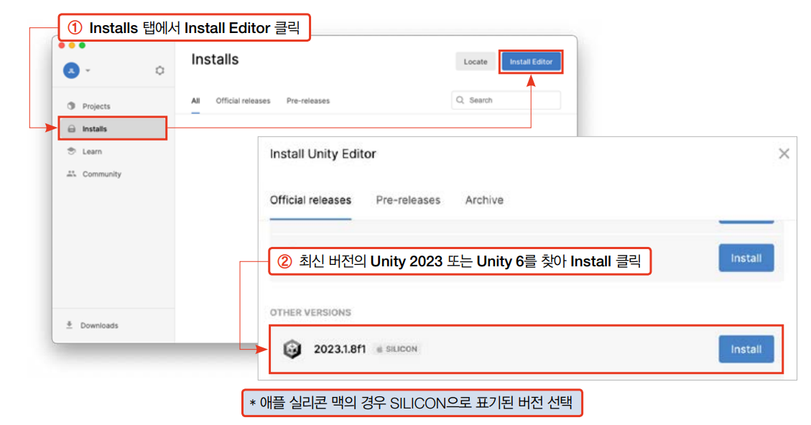  
  
- 유니티 아카이브  
유니티 허브의 설치 창에서는 몇 가지 주요 버전의 유니티 에디터만 보여준다. 따라서 원하는 버전의 유니티 에디터가 설치 목록에 없을 수 있다.  
  
이떄는 유니티 아카이브(https://unity3d.com/get-unity/download/archive)를 사용할 수 있다. 유니티 아카이브에서는 과거 모든 버전의 유니티 
에디터를 찾아 설치할 수 있다. 원하는 버전을 찾아 Unity Hub 버튼을 클릭하면 앱 링크를 통해 유니티 허브에서 해당 버전의 유니티 에디터를 설치하는 
창이 열린다.  
  
3. Install 버튼을 누른 다음에는 추가 모듈을 선택하는 화면이 표시된다.  
  
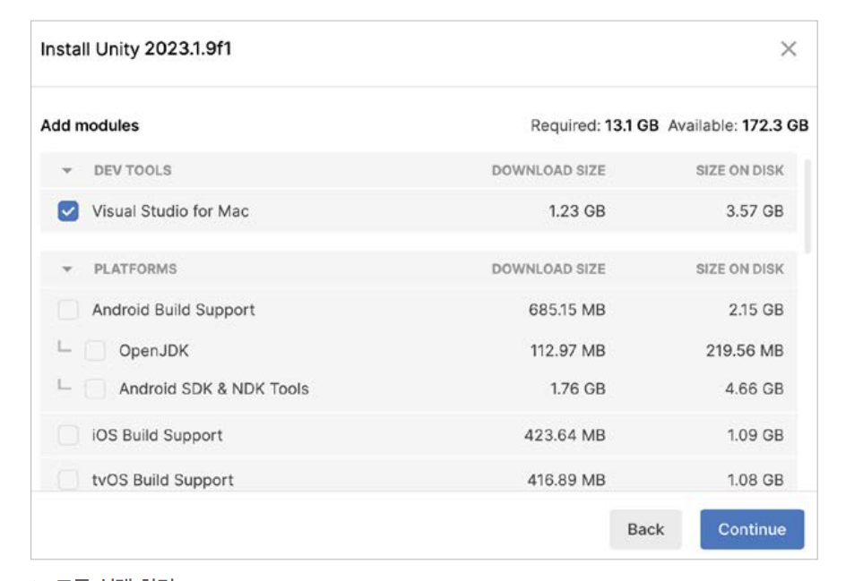  
  
학습을 진행하는 데 꼭 필요한 필수 모듈은 다음과 같다.  
  
- Visual Studio: 유니티에서 사용하는 코드 편집기(윈도우는 Community, 맥OS는 for Mac 에디션). 컴퓨터에 이미 비주얼 스튜디오가 설치되어 있으면 
체크박스가 표시되지 않는다.  
- 맥의 경우: Mac Build Support(IL2CPP)  
- 윈도우의 경우: Windows Build Support(IL2CPP)  
  
Mac Build Support (IL2CPP)와 Windows Build Support(IL2CPP)는 데스크톱용으로 게임을 빌드할 떄 IL2CPP를 사용할 수 있도록 하는 모듈이다.  
  
이 둘이 없어도 맥 또는 윈도우 테스크톱용으로 게임을 빌드할 수 있지만 IL2CPP를 사용하면 추가적인 성능이나 보안 이점을 누릴 수 있다.  
이외에 부록의 안드로이드나 iOS 빌드를 진행하려면 다음 모듈이 필요하다.  
  
- Android Build Support  
OpenJDK  
Android SDK & NDK Tools  
- iOS Build Support  

필수 모듈 이외의 모듈들은 설치하지 않아도 개발에 영향을 주지 않는다. 이들은 나중에 개별적으로 설치할 수 있다.  
  
4. 필수 모듈들을 체크  
5. Continue 버튼 클릭  
  
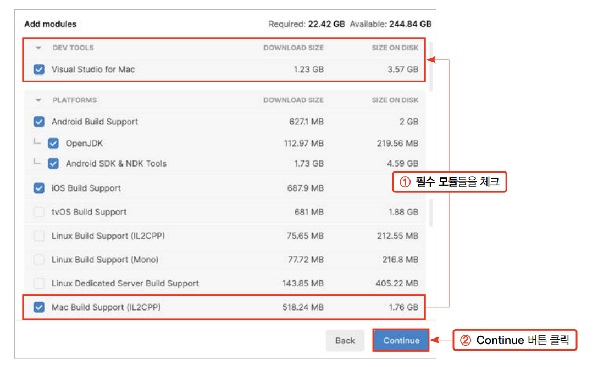  
  
설치 완료된 유니티 에디터는 Installs 탭에서 확인할 수 있다.  
  
## **모듈 추가하기**  
1. 유니티 허브의 Installs 탭 > 유니티 에디터 오른쪽의 톱니바퀴 버튼 > Add modules 버튼  
  
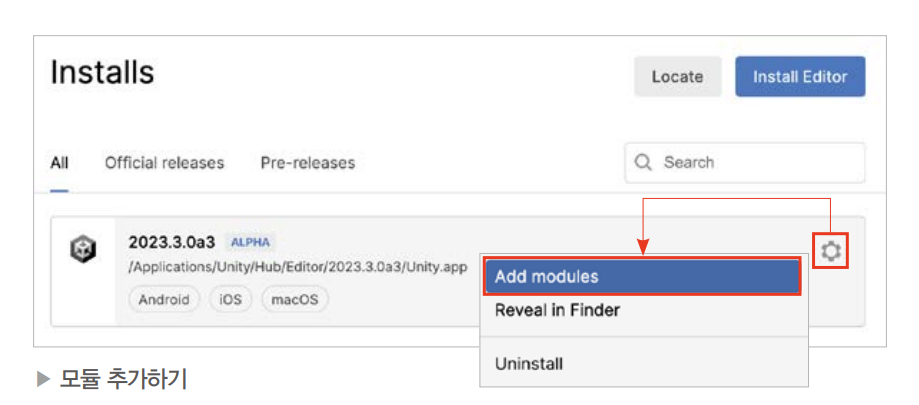  
  
# **첫 프로젝트 생성하기**  
1. 새 프로젝트 생성(Projects 탭 클릭) > New project 버튼 클릭  
  
새 프로젝트 생성 화면으로 이동하면 필요한 프로젝트 설정을 입력해야 한다.  
  
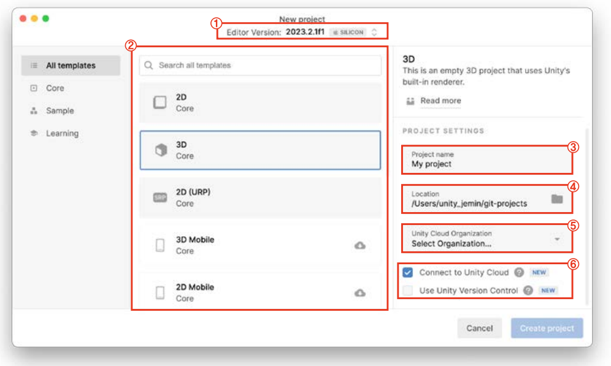  
  
- 에디터 버전: 사용할 유니티 에디터 버전. 유니티 허브에서는 여러 버전의 유니티 에디터를 설치할 수 있다. 따라서 프로젝트를 열거나 새로 만들 떄 사용할 
유니티 버전을 선택할 수 있다.  
- 템플릿: 프로젝트를 구성하는 데 사용할 템플릿. 초기 셋업 이외에는 개발에 영향을 주지 않는다. 일부 템플릿은 인터넷을 통해 다운로드받기 떄문에 
경우에 따라 표시되지 않을 수 있다.  
- 프로젝트명: 프로젝트 이름이자 생성될 프로젝트 폴더의 이름  
- 경로: 프로젝트 폴더가 생성될 위치. 경로에 한국어가 포함되지 않도록 주의.  
- 유니티 클라우드 조직: 어떤 팀 조직 아래에 프로젝트를 만들 것인지 결정한다.  
- 유니티 클라우드 연동: 각각 유니티 클라우드 서비스에 프로젝트를 연동할지와 유니티 버전 관리 서비스를 사용할지를 결정한다.  
  
에디터 버전의 경우 유니티 에디터를 하나만 설치했기 떄문에 기본값을 그대로 사용하면 된다.  
  
2. 새 프로젝트 생성  
- 에디터 버전: 할당된 기본값을 그대로 사용  
- 템플릿: 기본 템플릿 3D를 그대로 사용  
- 프로젝트명: Hello Unity로 변경  
- 경로: 선택  
- 조직: 선택 가능한 아무 조직 중 하나를 선택  
- Create project 버튼 클릭  
  
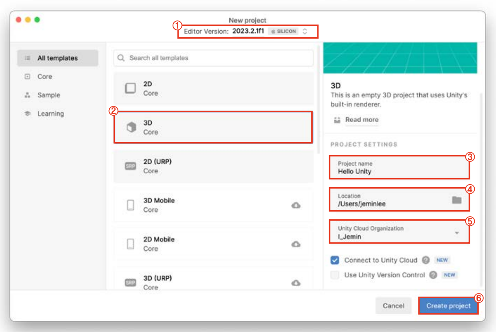  
  
위 과정을 끝내면 새로운 프로젝트가 생성되고 실행되어 다음 화면이 표시된다.  
  
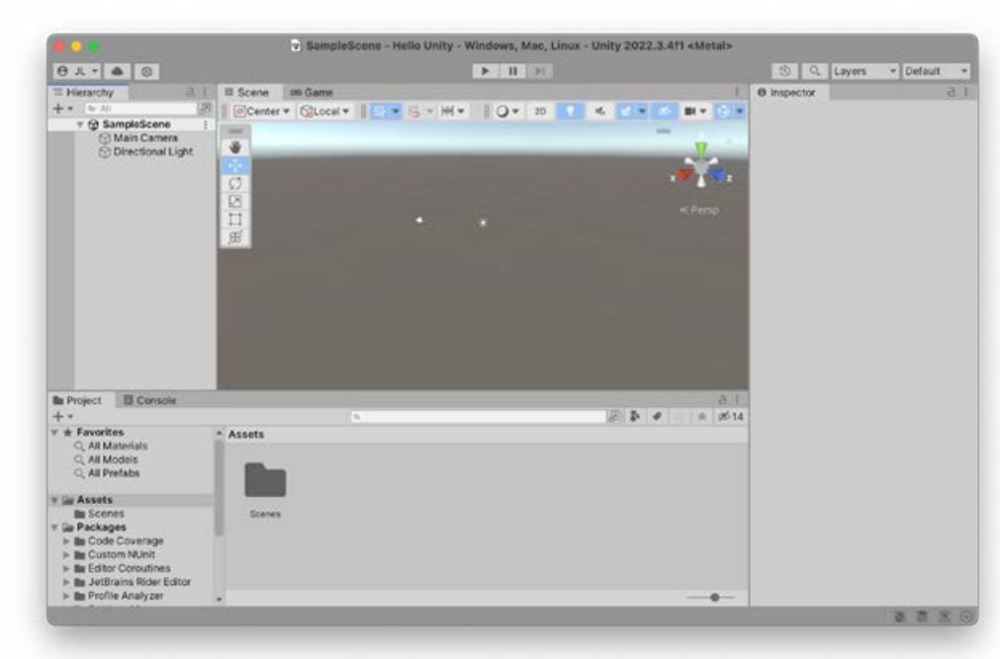  
  
- 환경 설정과 테마  
테마니는 유니티 허브의 Appearance 설정과 유니티 에디터의 Editor Theme 설정에서 수정할 수 있다.  
  
- 유니티 허브 테마 변경  
톱니바퀴 버튼을 눌러 환경 설정 열기 > Appearance 탭 > Theme 항목 수정  
  
- 유니티 에디터 테마 변경  
유니티 에디터 환경 설정 열기  
윈도우: 유니티 최상단 메뉴의 Edit > Settings  
맥: 유니티 최상단 메뉴의 Unity > Settings  
  
General 탭에서 에디터 테마(Editor Theme) 항목 수정  
  
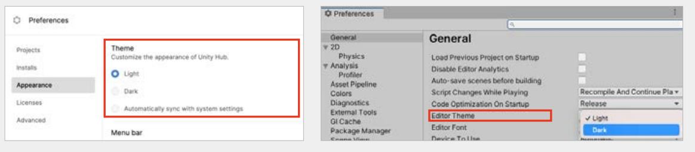  
  
# **3D 큐브 오브젝트 생성하기**  
간단한 3D 큐브 오브젝트를 생성한다. 유니티 에디터 좌측 상단을 보면 하이어라키(Hierarchy)창이 있다. 하이어라키 창에는 현재 씬에 존재하는 모든 게임 
오브젝트가 표시된다. 씬은 하나의 게임 월드를 뜻한다.  
  
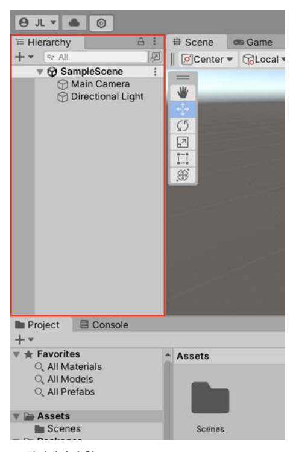  
  
하이어라키 창에서 Main Camera 게임 오브젝트와 Directional Light 게임 오브젝트를 확인할 수 있다. 이들은 새로운 씬을 만들 때 자동으로 함께 생성된다. 
Main Camera는 플레이어가 보게 될 게임 화면을, 그리고 Directional Light는 씬에 빛을 만든다.  
  
하이어라키 창 좌촉 상단에는 + 버튼이 있어 새로운 게임 오브젝트를 생성할 수 있다.  
  
1. 하이어라키 창에서 + > 3D Object > Cube 클릭  
  
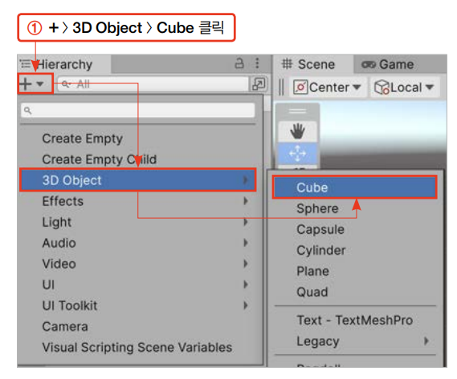  
  
새로운 Cube 게임 오브젝트가 생성되고 하이어라키 창에 표시된다. 화면 중앙의 씬 창에서도 추가된 Cube의 모습을 확인할 수 있다.  
  
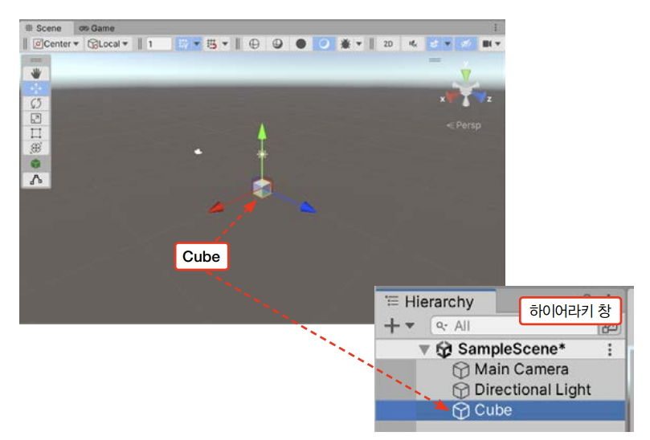  
  
씬 창은 현재 씬의 게임 오브젝트를 시각적으로 편집하는 창이다. 이제 게임이 실행되면 생성한 큐브가 어떻게 동작할지 테스트해본다. 유니티 중앙 상단에는 
씬 컨트롤 버튼들이 있다.  
  
  
  
3개의 버튼 중 가장 좌측에 있는 플레이 버튼으로 플레이 모드를 실행하여 씬을 시작하고 테스트할 수 있다.  
  
2. 플레이 버튼 클릭  
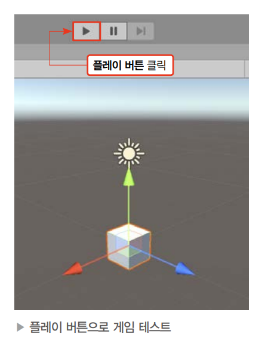  
  
플레이 버튼을 클릭하면 게임이 시작되고 플레이 모드로 진입한다. 플레이 모드에서는 유니티 에디터가 전체적으로 조금 어두워지고 플레이 버튼이 파란색으로 
바뀐다. 그리고 화면 중앙의 씬 창이 게임창으로 전환된다. 게임 창에는 플레이어가 보게 될 게임 화면이 나타난다.  
  
현재는 게임에 어떠한 변화도 일어나지 않는다. 큐브 게임 오브젝트에 어떠한 기능도 추가하지 않았기 떄문이다. 큐브에 새로운 기능을 추가하기 위해 플레이 모드를 
해제하고 편집 모드로 돌아간다.  
  
3. 플레이 모드 해제  
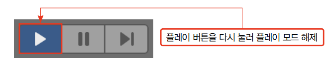  
  
플레이 모드를 해제하면 플레이 버튼과 유니티 에디터가 원래 색으로 돌아온다. 플레이 버튼은 토클 버튼이므로 누를 때마다 활성화/비활성화가 전환된다.  
  
4. 바닥 만들기  
큐브가 중력의 영향을 받아 아래로 떨어지게 한다. 이떄 바닥이 없으면 큐브가 끝없이 떨어지므로 바닥(Plane)을 먼저 만든다.  
  
하이어라키 창에서 + > 3D Object > Plane 클릭  
  
하이어라키 창에서 Plane 게임 오브젝트가 추가되고 씬 창에 하얀 바닥이 생긴다.  
  
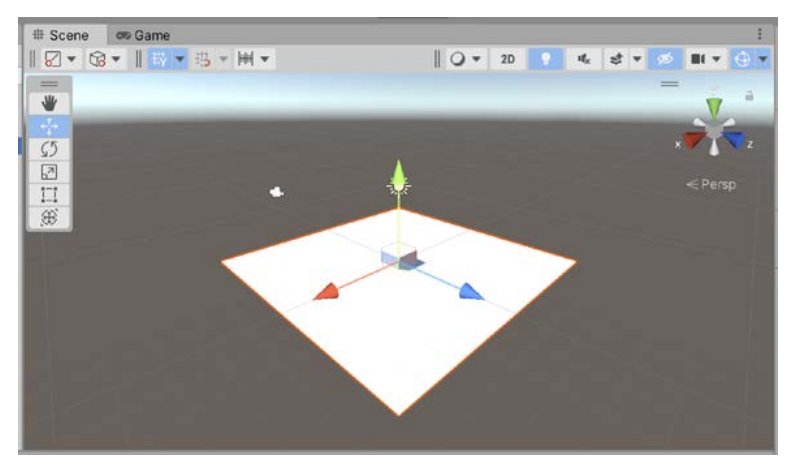  
  
그런데 바닥과 큐브가 겹쳐 있다. 따라서 큐브를 위로 옮기기 위해 큐브를 선택한다.  
  
5. 큐브 선택  
하이라키 창에서 Cube 클릭  
  
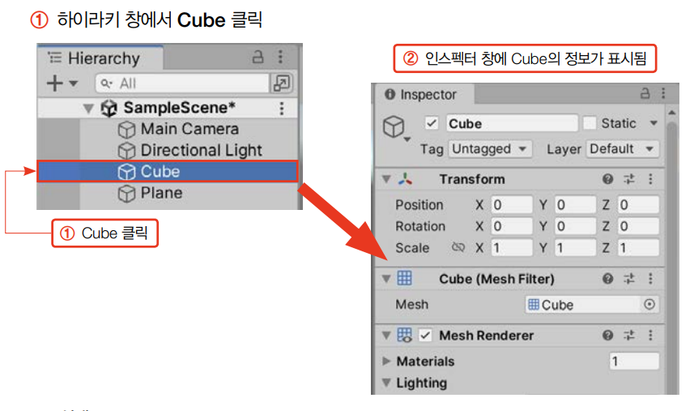  
  
Cube 게임 오브젝트를 선택하면 유니티 에디터 우측에 있는 인스펙터(Inspector)창에 Cube 게임 오브젝트의 정보가 표시된다. 인스펙터 창은 게임 오브젝트의 
정보와 컴포넌트가 나열되는 곳이다.  
  
게임 오브젝트에는 다양한 부품이 조립될 수 있다. 그러한 부품들을 컴포넌트라고 부른다. 컴포넌트가 조립된 게임 오브젝트는 컴포넌트가 제공하는 능력을 
가지게 된다.  
  
트랜스폼(Transform) 컴포넌트는 3D 공간에서의 위치를 결정한다. 따라서 인스펙터 창에 있는 Cube의 트랜스폼 컴포넌트 위치(Position)값을 수정하면 
Cube 위치를 옮길 수 있다.  
  
6. 큐브를 위로 옮기기  
인스펙터 창에서 Transform 컴포넌트의 Position의 Y를 3으로 변경  
  
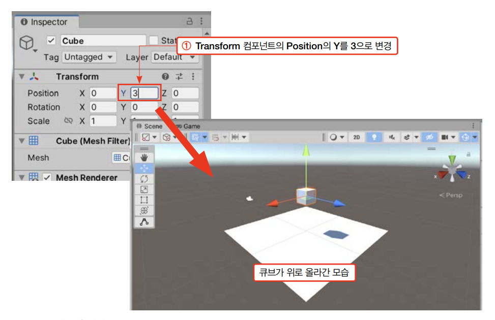  
  
이제 큐브가 중력을 받아 떨어지게 한다. 게임 오브젝트에는 컴포넌트라는 부품을 조립할 수 있다고 했다. 큐브가 중력의 영향을 받는 물리적인 물체가 되려면 
큐브에 물리 기능을 가진 컴포넌트를 조립해야 한다.  
  
큐브에 리지드바디(Rigidbody) 컴포넌트를 추가한다. 리지드바디 컴포넌트는 게임 오브젝트가 물리와 중력의 영향을 받게 한다.  
  
인스펙터 창 하단의 Add Component 버튼을 클릭하여 게임 오브젝트에 새로운 컴포넌트를 추가할 수 있다.  
  
4. 리지드바디 컴포넌트 추가  
인스펙터 창에서 Add Component > Physics > Rigidbody 클릭  
  
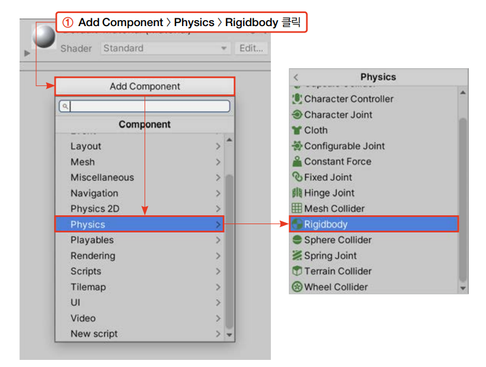  
  
Cube에 추가된 리지드바디 컴포넌트는 인스펙터 창에서 확인할 수 있다.  
  
Cube에 필요한 셋업이 다 되었으므로 다시 한번 게임을 테스트해본다.  
  
